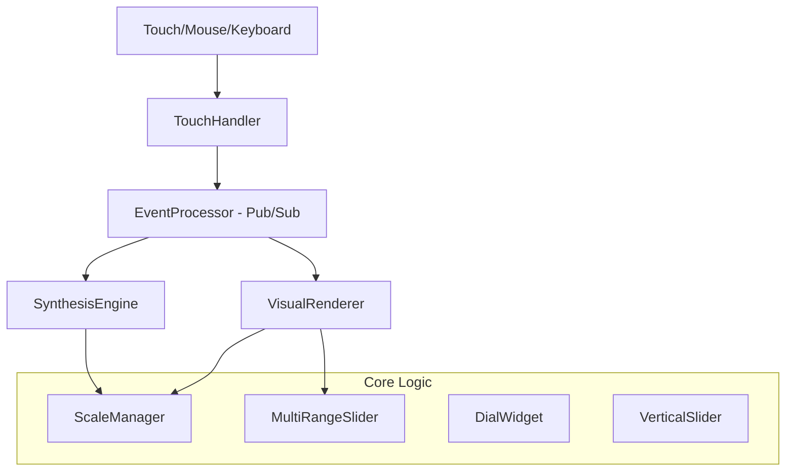

# Design Document: Pentatonic Synth

## 1. Overview

The **Pentatonic Synth** is a web-based virtual instrument that transforms touch screen devices into expressive musical instruments. The system is built on the philosophy of **Intuitive Complexity**: exploiting the naturally accessible pentatonic scale to democratize music theory. 

It allows users who are not trained in musical theory to access and perform rich, sophisticated harmonies that utilize the full chromatic spectrum. By handling harmonic logic within the audio engine, the instrument ensures that every interaction is musically valid while remaining creatively deep.

## 2. Architecture

The system uses a modular, event-driven architecture to decouple input handling from audio/visual processing.



### 2.1. Layers

- **Touch Interface Layer**: Captures multi-touch and mouse input across a 5x3 grid. Supports microtonal expression via vertical (Pitch) and horizontal (Timbre) sliding.
- **Event Processing Layer**: Uses a global Pub/Sub bus (`EventProcessor`) to broadcast `NOTE_ON`, `NOTE_OFF`, and `NOTE_MODULATE` events.
- **Audio Engine Layer**: Manages polyphonic synthesis, chromatic harmonic expansion, and real-time parameter modulation.
- **Visual Feedback Layer**: High-performance Canvas renderer with responsive high-DPI scaling and octave-based brightness distinction.

## 3. Components and Interfaces

### 3.1. ScaleManager (Static Utility)
- Maps 12 chromatic roots and 5 scale types.
- Provides `generateHarmony()` for chromatic expansion (Maj7, Min9, etc.).

### 3.2. SynthesisEngine
- **Lazy Initialization**: AudioContext created only after user gesture.
- **Polyphonic Modulation**: Supports real-time per-voice pitch bending ($\pm 1$ semitone) and filter cutoff shaping.
- **Signal Chain**: Oscillator $\rightarrow$ Low-pass Filter $\rightarrow$ VCA (Envelope) $\rightarrow$ Master Gain.

### 3.3. VisualRenderer
- **Octave Split**: 25%/50%/25% vertical layout.
- **Responsive Logic**: MutationObserver-based recalculations for fluid window resizing.

### 3.4. Specialized Widgets
- **MultiRangeSlider**: Independent control of three octave pegs.
- **DialWidget**: NS-resize based knobs for synthesis parameters.
- **VerticalSlider**: Dedicated high-resolution volume control.

## 4. Data Models

### NoteModulateEvent
```typescript
{
  index: number;        // Note index
  octave: number;       // Triggered octave
  pitchBend: number;    // -1 to 1 semitones
  timbre: number;       // 0 to 1 filter offset
}
```

### PresetSchema
```typescript
{
  name: string;
  waveform: Waveform;
  envelope: EnvelopeParams;
  filter: FilterParams;
  effects: { delay: number, reverb: number };
}
```

## 5. Future Roadmap

### 5.1. Audio Effects Chain (NEW)
- **Stereo Delay**: Implementation of a feedback loop with `DelayNode` and `PanNode`.
- **Global Reverb**: Convolution-based or algorithmic shimmer using a shared `ConvolverNode`.

### 5.2. LFO Engine (Movement)
- Implement a Low-Frequency Oscillator to modulate Pitch (Vibrato) or Filter (Tremolo).
- Add "Depth" and "Rate" dials.

### 5.3. Preset System
- **Persistence**: Integration with `localStorage` for saving user-defined patches.
- **Factory Bank**: Initial set of "Classic Lead", "Deep Bass", and "Ethereal Pad".

### 5.4. Visual "Juice"
- Update the VisualRenderer to show "glow" or "ripple" effects reactive to `NoteModulateEvent`.
- Implement a background spectrum analyzer (Fast Fourier Transform).
