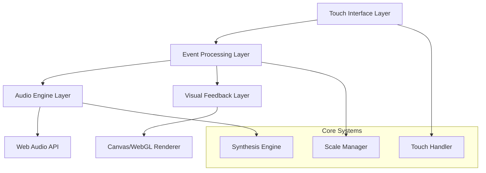

# Design Document: Pentatonic Synth

## 1. Overview

The **Pentatonic Synth** is a web-based virtual instrument that transforms touch screen devices into expressive musical instruments. The system consists of three main layers: a responsive touch interface, a real-time audio synthesis engine, and a visual feedback system. The instrument uses the pentatonic scale to provide an accessible yet musically rich playing experience.

The architecture follows a modular design with clear separation between input handling, audio processing, and visual rendering. This enables independent optimization of each component while maintaining tight integration for real-time performance.

## 2. Technology Stack

To ensure performance, maintainability, and correctness, the project uses the following modern stack:

- **Language**: [TypeScript](https://www.typescriptlang.org/) (Strict mode enabled) for type-safe interaction with complex audio/visual APIs.
- **Build Tool**: [Vite](https://vitejs.dev/) for fast development iteration and efficient ES module bundling.
- **Testing**:
    - [Vitest](https://vitest.dev/) for unit testing.
    - [fast-check](https://fast-check.dev/) for property-based testing (validating musical properties and system stability).
- **Core APIs**:
    - **Web Audio API**: For low-latency, client-side sound synthesis.
    - **Canvas API**: For high-performance (60fps) visual rendering.
- **CI/CD**: GitHub Actions for automated testing and deployment.

## 3. Architecture

The system uses a layered architecture with the following components:



### 3.1. Layers

- **Touch Interface Layer**: Captures and processes multi-touch input, handling gesture recognition and touch pressure detection.
- **Event Processing Layer**: Implements a **Pub/Sub (Publisher/Subscriber)** pattern to decouple input rates from processing rates. This ensures that high-frequency audio processing and frame-based visual rendering can consume events at their optimal cadence without blocking each other.
- **Audio Engine Layer**: Manages polyphonic synthesis, applies effects, and handles audio output through the Web Audio API.
- **Visual Feedback Layer**: Renders real-time visual responses to user interactions using hardware-accelerated graphics.

## 4. Components and Interfaces

### 3.1. TouchHandler Component

**Purpose**: Manages all touch input processing and gesture recognition.

**Key Methods**:
- `handleTouchStart(event)`: Processes initial touch contact.
- `handleTouchMove(event)`: Tracks touch movement and pressure changes.
- `handleTouchEnd(event)`: Handles touch release and note-off events.
- `calibrateTouchSensitivity()`: Adjusts sensitivity based on device capabilities.

**Interfaces**:
- **Input**: Raw touch events from browser.
- **Output**: Normalized touch data with pressure, position, and timing.

### 3.2. ScaleManager Component

**Purpose**: Handles pentatonic scale calculations and transposition.

**Key Methods**:
- `generatePentatonicFrequencies(root, octave)`: Calculates note frequencies.
- `transposeScale(newRoot)`: Changes the scale root note.
- `getNoteFromPosition(x, y)`: Maps screen coordinates to musical notes.
- `getFrequency(noteIndex, octave)`: Returns frequency for specific note.

**Scale Implementation**:
The pentatonic scale uses the following interval ratios from the root:
- **Root**: 1.0
- **Second**: 9/8 (1.125)
- **Third**: 5/4 (1.25)
- **Fifth**: 3/2 (1.5)
- **Sixth**: 5/3 (1.667)

### 3.3. SynthesisEngine Component

**Purpose**: Generates and processes audio signals in real-time.

**Key Methods**:
- `createOscillator(frequency, waveform)`: Creates audio oscillator.
- `applyEnvelope(audioNode, attack, decay, sustain, release)`: Applies ADSR envelope.
- `addEffect(audioNode, effectType, parameters)`: Applies audio effects.
- `setPolyphonyLimit(maxVoices)`: Manages voice allocation.

**Synthesis Architecture**:
`Oscillator` → `Envelope` → `Filter` → `Effects` → `Master Output`

**Voice Management**: Uses a voice pool with priority-based allocation. When polyphony limit is reached, oldest or quietest voices are recycled.

### 3.4. VisualRenderer Component

**Purpose**: Provides real-time visual feedback for touch interactions.

**Key Methods**:
- `renderNoteAreas()`: Draws the pentatonic scale interface.
- `updateTouchFeedback(touchData)`: Updates visual feedback for active touches.
- `animateNoteActivation(noteIndex, intensity)`: Animates note activation.
- `setColorScheme(scheme)`: Changes visual appearance.

**Rendering Strategy**: Uses Canvas 2D API with `requestAnimationFrame` for smooth 60fps updates. Visual elements are pre-calculated and cached for performance.

### 3.5. AudioContext Manager

**Purpose**: Manages Web Audio API context and audio routing.

**Key Methods**:
- `initializeAudioContext()`: Sets up audio context and master chain.
- `createAudioNode(type, parameters)`: Factory for audio nodes.
- `connectAudioChain(nodes)`: Connects audio processing chain.
- `handleAudioContextSuspension()`: Manages browser audio policy compliance.

## 4. Data Models

### TouchEvent Model
```javascript
{
  id: string,           // Unique touch identifier
  x: number,           // Screen x coordinate (0-1 normalized)
  y: number,           // Screen y coordinate (0-1 normalized)
  pressure: number,    // Touch pressure (0-1, fallback to 0.5)
  timestamp: number,   // High-resolution timestamp
  phase: string        // 'start', 'move', 'end'
}
```

### NoteEvent Model
```javascript
{
  noteIndex: number,   // Index in pentatonic scale (0-4)
  frequency: number,   // Fundamental frequency in Hz
  velocity: number,    // Note velocity (0-1)
  octave: number,      // Octave number
  duration: number,    // Note duration in milliseconds
  touchId: string      // Associated touch identifier
}
```

### SynthParameters Model
```javascript
{
  waveform: string,    // 'sine', 'square', 'sawtooth', 'triangle'
  attack: number,      // Envelope attack time (0-2 seconds)
  decay: number,       // Envelope decay time (0-2 seconds)
  sustain: number,     // Envelope sustain level (0-1)
  release: number,     // Envelope release time (0-5 seconds)
  filterCutoff: number,// Low-pass filter cutoff (20-20000 Hz)
  filterResonance: number, // Filter resonance (0-30)
  masterVolume: number // Master volume (0-1)
}
```

### InterfaceLayout Model
```javascript
{
  noteAreas: Array<{
    x: number,         // Area x position (0-1 normalized)
    y: number,         // Area y position (0-1 normalized)
    width: number,     // Area width (0-1 normalized)
    height: number,    // Area height (0-1 normalized)
    noteIndex: number, // Associated pentatonic scale index
    color: string      // Visual color representation
  }>,
  orientation: string, // 'portrait' or 'landscape'
  scaleFactor: number  // UI scaling factor for different screen sizes
}
```

## 5. Correctness Properties

Properties serve as the bridge between human-readable specifications and machine-verifiable correctness guarantees.

### 5.1. Core Functionality
- **Property 1: Touch to Audio Response**
    - *For any* valid touch event on a note area, the audio engine should trigger the corresponding note frequency within the specified latency limit and provide immediate visual feedback.
    - **Validates:** Requirements 2.1, 5.1

- **Property 2: Multi-touch Polyphony**
    - *For any* set of simultaneous touch events on different note areas, the system should produce the corresponding number of simultaneous audio outputs with distinct visual feedback for each.
    - **Validates:** Requirements 2.2, 5.4

- **Property 3: Touch Release Behavior**
    - *For any* active note, when the associated touch is released, the audio engine should apply appropriate note-off behavior and visual feedback should return to inactive state.
    - **Validates:** Requirements 2.3, 5.5

- **Property 4: Pressure Sensitivity Response**
    - *For any* touch event with pressure variation, both audio parameters (volume/timbre) and visual feedback intensity should scale proportionally with the pressure value.
    - **Validates:** Requirements 2.4, 5.3

- **Property 5: Touch Area Filtering**
    - *For any* touch event outside designated note areas or with characteristics indicating accidental contact, no note should be triggered.
    - **Validates:** Requirements 2.5

### 5.2. Musical Correctness
- **Property 6: Pentatonic Scale Accuracy**
    - *For any* pentatonic scale configuration, the generated frequencies should match the mathematically correct ratios relative to the root frequency.
    - **Validates:** Requirements 4.1

- **Property 7: Scale Transposition Consistency**
    - *For any* change in root note, all note frequencies should be transposed by the same ratio, maintaining correct pentatonic intervals.
    - **Validates:** Requirements 4.2, 4.3

- **Property 8: Octave Frequency Relationships**
    - *For any* note across different octaves, the frequency relationship should maintain exact 2:1 ratios between corresponding notes in adjacent octaves.
    - **Validates:** Requirements 4.4

### 5.3. Interface & Performance
- **Property 9: Interface Layout Consistency**
    - *For any* screen size or orientation within the supported range, note areas should maintain logical musical progression, visual distinction, and consistent spacing.
    - **Validates:** Requirements 1.2, 1.3, 1.4, 1.5, 8.1, 8.3

- **Property 10: Real-time Parameter Application**
    - *For any* synthesis parameter change, the modification should apply immediately to subsequently triggered notes and take effect during performance without interrupting active notes.
    - **Validates:** Requirements 6.2, 6.5

- **Property 11: Preset Configuration Loading**
    - *For any* valid preset configuration, loading the preset should update all associated synthesis parameters to match the preset values.
    - **Validates:** Requirements 6.4

- **Property 12: Performance Consistency**
    - *For any* system load condition within normal operating parameters, touch response latency and visual frame rate should remain within acceptable bounds.
    - **Validates:** Requirements 7.2, 7.4

- **Property 13: Graceful Resource Management**
    - *For any* resource-constrained situation, the system should reduce polyphony or visual complexity before experiencing complete failure, and memory usage should remain stable during extended operation.
    - **Validates:** Requirements 7.3, 7.5

- **Property 14: Device Compatibility Adaptation**
    - *For any* supported device configuration, the interface should adapt appropriately to available capabilities, providing fallback options when advanced features are unavailable.
    - **Validates:** Requirements 8.4, 8.5

## 6. Error Handling

The system implements comprehensive error handling across all components:

- **Audio Context Errors**: Handle browser audio policy restrictions by providing user activation prompts. Gracefully degrade when Web Audio API features are unavailable.
- **Touch Input Errors**: Validate touch coordinates and pressure values, filtering invalid input. Implement timeout mechanisms for stuck touches.
- **Synthesis Errors**: Catch audio node creation failures and provide fallback synthesis methods. Monitor audio context state and recover from suspensions.
- **Memory Management**: Implement voice recycling to prevent memory leaks. Monitor memory usage and trigger garbage collection when necessary.
- **Device Compatibility**: Feature detection for touch pressure, audio capabilities, and screen characteristics. Provide appropriate fallbacks for unsupported features.

## 7. Testing Strategy

The testing approach combines unit tests for specific functionality with property-based tests for comprehensive coverage:

### Focus Areas
- **Unit Testing**: Specific examples of pentatonic scale calculations, edge cases for touch input, error conditions, and device compatibility.
- **Property-Based Testing**: Universal properties across all valid inputs, musical accuracy, performance under load, and visual/audio consistency.

### Configuration
- **Property Tests**: Minimum 100 iterations per property, referencing design properties.
- **Libraries**: Web Audio API test utilities, mock audio contexts, and property-based testing libraries (e.g., fast-check).

## 8. Deployment & CI/CD

The project adopts a Continuous Integration and Continuous Deployment (CI/CD) strategy to ensure stability and rapid delivery.

- **Automated Testing**: On every Pull Request, GitHub Actions will trigger:
    - `npm run lint`: Static code analysis.
    - `npm run test`: Unit and property-based tests.
    - `npm run build`: Production build verification.
- **Deployment**:
    - The application is a static site (Single Page Application).
    - Merges to the `main` branch automatically deploy to **GitHub Pages** (or Netlify/Vercel) via a dedicated workflow.
    - Semantic Versioning (semver) is used for releases.
