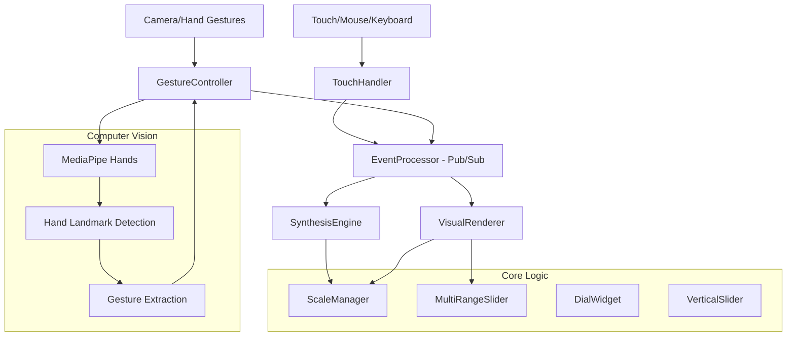

# Design Document: Pentatonic Synth

## 1. Overview

The **Pentatonic Synth** is a web-based virtual instrument that transforms touch screen devices into expressive musical instruments. The system is built on the philosophy of **Intuitive Complexity**: exploiting the naturally accessible pentatonic scale to democratize music theory. 

It allows users who are not trained in musical theory to access and perform rich, sophisticated harmonies that utilize the full chromatic spectrum. By handling harmonic logic within the audio engine, the instrument ensures that every interaction is musically valid while remaining creatively deep.

## 2. Architecture

The system uses a modular, event-driven architecture to decouple input handling from audio/visual processing.



### 2.1. Layers

- **Touch Interface Layer**: Captures multi-touch and mouse input across a 5x3 grid. Supports microtonal expression via vertical (Pitch) and horizontal (Timbre) sliding.
- **Gesture Interface Layer** (NEW): Camera-based hand tracking using MediaPipe Hands. Extracts musical parameters from 21-point hand landmarks (position, pinch detection, depth).
- **Event Processing Layer**: Uses a global Pub/Sub bus (`EventProcessor`) to broadcast `NOTE_ON`, `NOTE_OFF`, and `NOTE_MODULATE` events from any input source.
- **Audio Engine Layer**: Manages polyphonic synthesis, chromatic harmonic expansion, and real-time parameter modulation.
- **Visual Feedback Layer**: High-performance Canvas renderer with responsive high-DPI scaling and octave-based brightness distinction.

## 3. Components and Interfaces

### 3.1. ScaleManager (Static Utility)
- Maps 12 chromatic roots and 5 scale types.
- Provides `generateHarmony()` for chromatic expansion (Maj7, Min9, etc.).

### 3.2. SynthesisEngine
- **Lazy Initialization**: AudioContext created only after user gesture.
- **Polyphonic Modulation**: Supports real-time per-voice pitch bending ($\pm 1$ semitone) and filter cutoff shaping.
- **Signal Chain**: Oscillator $\rightarrow$ Low-pass Filter $\rightarrow$ VCA (Envelope) $\rightarrow$ Master Gain.

### 3.3. VisualRenderer
- **Octave Split**: 25%/50%/25% vertical layout.
- **Responsive Logic**: MutationObserver-based recalculations for fluid window resizing.

### 3.4. Specialized Widgets
- **MultiRangeSlider**: Independent control of three octave pegs.
- **DialWidget**: NS-resize based knobs for synthesis parameters.
- **VerticalSlider**: Dedicated high-resolution volume control.

### 3.5. GestureController (NEW)
- **MediaPipe Integration**: Leverages Google's MediaPipe Hands for real-time hand tracking (21 landmarks per hand).
- **Gesture Mapping**:
  - Index finger X position → Note selection (5 zones)
  - Index finger Y position → Octave selection (3 levels)
  - Thumb-Index pinch distance → Note trigger (threshold-based)
  - Index finger Z depth → Velocity/volume
- **Visual Feedback**: Canvas overlay showing hand skeleton and landmarks.
- **Performance**: Model complexity 0 (fastest) for low-latency prototype.

## 4. Data Models

### NoteModulateEvent
```typescript
{
  index: number;        // Note index
  octave: number;       // Triggered octave
  pitchBend: number;    // -1 to 1 semitones
  timbre: number;       // 0 to 1 filter offset
}
```

### GestureData (NEW)
```typescript
{
  noteIndex: number;    // 0-4 for pentatonic notes
  octave: number;       // 3-5 for octave range
  velocity: number;     // 0-1 for volume/intensity
  isActive: boolean;    // finger pinched/closed
}
```

### HandLandmark (NEW)
```typescript
{
  x: number;           // Normalized 0-1 horizontal position
  y: number;           // Normalized 0-1 vertical position
  z: number;           // Depth relative to wrist
}
```

### PresetSchema
```typescript
{
  name: string;
  waveform: Waveform;
  envelope: EnvelopeParams;
  filter: FilterParams;
  effects: { delay: number, reverb: number };
}
```

## 5. Future Roadmap

### 5.1. Audio Effects Chain
- **Stereo Delay**: Implementation of a feedback loop with `DelayNode` and `PanNode`.
- **Global Reverb**: Convolution-based or algorithmic shimmer using a shared `ConvolverNode`.

### 5.2. LFO Engine (Movement)
- Implement a Low-Frequency Oscillator to modulate Pitch (Vibrato) or Filter (Tremolo).
- Add "Depth" and "Rate" dials.

### 5.3. Preset System
- **Persistence**: Integration with `localStorage` for saving user-defined patches.
- **Factory Bank**: Initial set of "Classic Lead", "Deep Bass", and "Ethereal Pad".

### 5.4. Visual "Juice"
- Update the VisualRenderer to show "glow" or "ripple" effects reactive to `NoteModulateEvent`.
- Implement a background spectrum analyzer (Fast Fourier Transform).

### 5.5. Advanced Gesture Control (EXPERIMENTAL)
Current implementation is a proof-of-concept. Future enhancements:

#### Phase 1: Refinement (Short-term)
- **Gesture Smoothing**: Implement Kalman filtering or exponential moving average to reduce jitter
- **Adaptive Thresholds**: Dynamic pinch detection based on hand size and camera distance
- **Calibration UI**: Allow users to calibrate gesture zones to their preference
- **Performance Optimization**: Reduce model complexity impact on audio thread
- **Multi-hand Support**: Enable two-hand polyphonic playing (left hand = bass, right hand = melody)

#### Phase 2: Enhanced Mapping (Mid-term)
- **Hand Orientation**: Use palm rotation for filter cutoff or effect wet/dry
- **Finger Spread**: Map individual finger distances to chord voicing or arpeggio speed
- **Gesture Velocity**: Detect swipe speed for note attack intensity
- **Hover Distance**: Use Z-axis depth for continuous parameter control (vibrato, tremolo)
- **Custom Gestures**: Train ML model for user-defined gesture patterns

#### Phase 3: Advanced Features (Long-term)
- **Pose-based Presets**: Switch sound presets using specific hand poses (peace sign, fist, etc.)
- **Spatial Audio**: Map hand position to stereo panning and 3D audio positioning
- **Recording Mode**: Capture gesture sequences for playback/looping
- **Collaborative Mode**: Multiple cameras/hands for ensemble performance
- **AR Integration**: Overlay virtual keyboard or visual guides using WebXR

#### Technical Considerations
- **Latency Optimization**: Target <50ms end-to-end latency (camera → audio)
- **Offline Mode**: Investigate TensorFlow.js for local model inference without CDN dependency
- **Mobile Support**: Optimize for mobile cameras with lower resolution/framerate
- **Accessibility**: Ensure gesture control doesn't replace but augments existing input methods
- **Privacy**: Add clear indicators when camera is active, local processing only

#### Research Directions
- **EMG Integration**: Explore muscle sensor input for subtle gesture control
- **Eye Tracking**: Use gaze for note selection, hands for triggering
- **Depth Cameras**: Leverage Intel RealSense or similar for improved 3D tracking
- **Haptic Feedback**: Investigate ultrasonic haptics for tactile response in air
