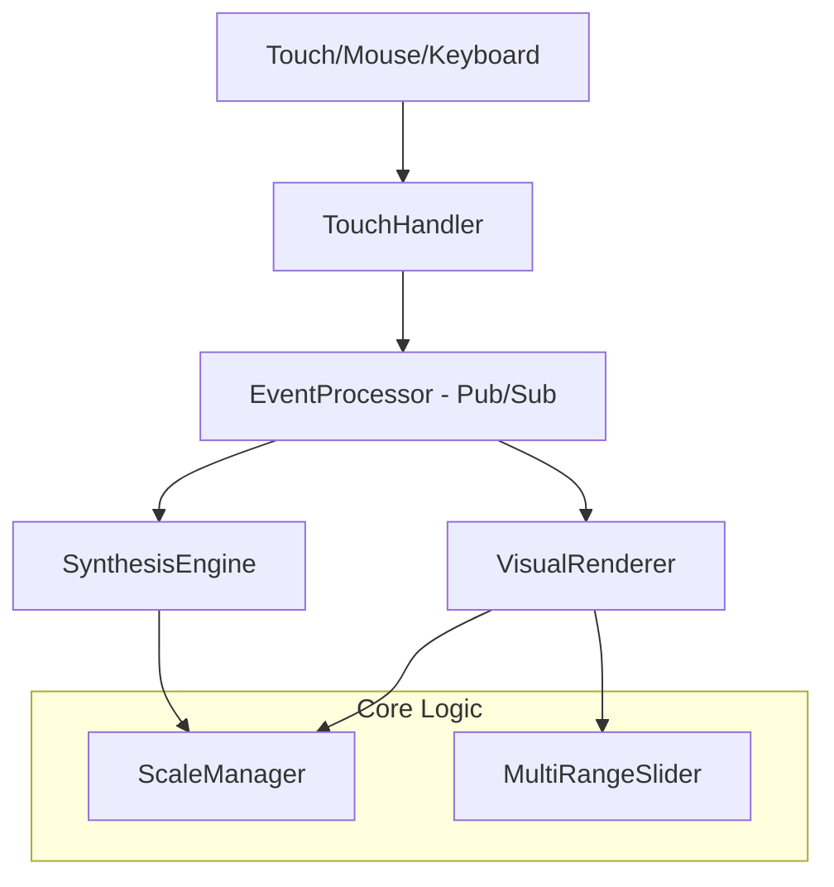

# Design Document: Pentatonic Synth

## 1. Overview

The **Pentatonic Synth** is a web-based virtual instrument that transforms touch screen devices into expressive musical instruments. The system is built on the philosophy of **Intuitive Complexity**: exploiting the naturally accessible pentatonic scale to democratize music theory. 

It allows users who are not trained in musical theory to access and perform rich, sophisticated harmonies that utilize the full chromatic spectrum. By handling harmonic logic within the audio engine, the instrument ensures that every interaction is musically valid while remaining creatively deep.

## 2. Architecture

The system uses a modular, event-driven architecture to decouple input handling from audio/visual processing.



### 2.1. Layers

- **Touch Interface Layer**: Captures multi-touch and mouse input across a 5x3 grid (5 notes x 3 octave zones).
- **Event Processing Layer**: Uses a global Pub/Sub bus (`EventProcessor`) to broadcast `NOTE_ON`, `NOTE_OFF`, and `PARAM_CHANGE` events.
- **Audio Engine Layer**: Manages polyphonic synthesis, chromatic harmonic expansion, and looping arpeggiation.
- **Visual Feedback Layer**: High-performance Canvas renderer with responsive high-DPI scaling and octave-based brightness distinction.

## 3. Components and Interfaces

### 3.1. ScaleManager (Static Utility)
**Purpose**: The central musical intelligence of the synth.
- Maps 12 chromatic roots and 5 scale types (Major, Minor, Blues, Yo, Hirajoshi).
- Provides `generateHarmony()` which expands a single pentatonic trigger into complex chromatic structures (Maj7, Min9, etc.).
- Calculates mathematically precise frequencies based on semitone ratios.

### 3.2. SynthesisEngine
**Purpose**: Manages the Web Audio API context and voice allocation.
- **Lazy Initialization**: Context is created and resumed only after an explicit user gesture (Start Overlay).
- **Polyphonic Voice Pool**: Manages up to 32 simultaneous oscillators with ADSR envelopes.
- **Advanced Modes**: Supports static chord stacks and dynamic looping arpeggiators.

### 3.3. VisualRenderer
**Purpose**: Renders the instrument interface at 60fps.
- **Octave Split**: Implements a 25%/50%/25% vertical height split for the 3-octave regions.
- **High-DPI Support**: Automatically adjusts internal resolution to match device pixel density.
- **Dynamic Shading**: Uses brightness shifts to visually distinguish between different octave rows.

### 3.4. TouchHandler
**Purpose**: Normalizes input from diverse sources.
- Handles Multi-touch, Mouse (with Glissando), and Keyboard (`A-G`).
- Translates screen coordinates into specific `{ noteIndex, octave }` pairs using the renderer's layout data.

### 3.5. MultiRangeSlider
**Purpose**: Custom UI widget for range control.
- Manages three independent handles on a single track.
- Used for mapping the Top, Middle, and Bottom UI rows to arbitrary octaves.

## 4. Data Models

### NoteOnEvent
```typescript
{
  index: number;        // Pentatonic index (0-4)
  octave: number;       // Triggered octave (1-8)
  frequency: number;    // Calculated root frequency
  velocity: number;     // Trigger intensity
  harmonyType: string;  // 'none', 'chord', 'power', 'arpeggio'
  chordType: string;    // 'maj7', 'min9', 'sus4', etc.
}
```

### InterfaceLayout (NoteArea)
```typescript
{
  index: number;        // Pentatonic note index
  octave: number;       // Row-specific octave
  x, y, width, height: number; // Pixel coordinates
  color: string;        // Assigned note color
}
```

## 5. Performance & UX

- **Autoplay Compliance**: A "Start" overlay ensures the instrument is only activated after a deliberate user action, preventing browser audio blocking.
- **Responsive Workspace**:
    - **Landscape**: Three-column grid optimizing sidebar accessibility.
    - **Portrait**: Stacked layout ensuring the instrument remains finger-scaled (approx. 120px per key).
- **Latency**: Audio triggers targets < 20ms response time using the Web Audio API's `currentTime` scheduling.

## 6. Testing Strategy

- **Property-Based Testing**: Validates that all scale/root combinations maintain correct musical intervals.
- **Unit Testing**: Ensures robust voice recycling and arpeggiator cleanup in the SynthesisEngine.
- **Responsive Verification**: Verified against both desktop (Firefox/Chrome) and mobile viewport simulations.